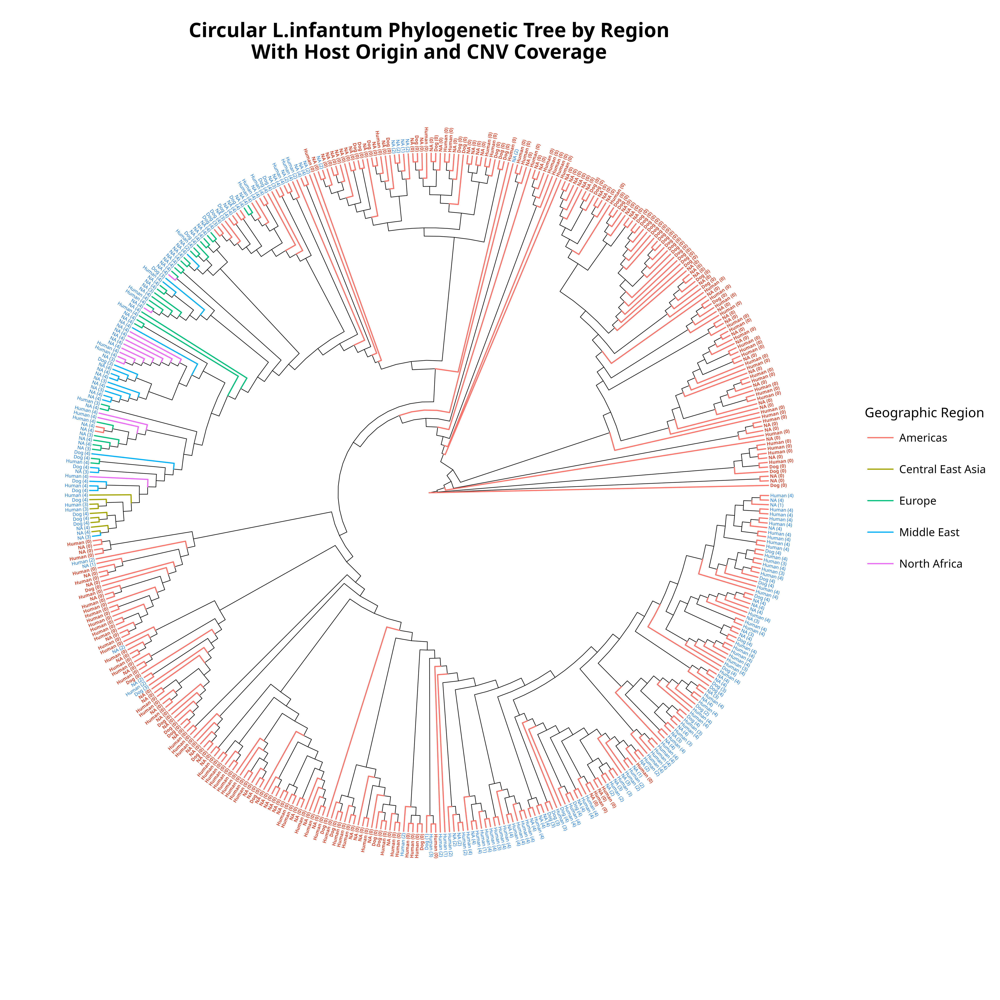
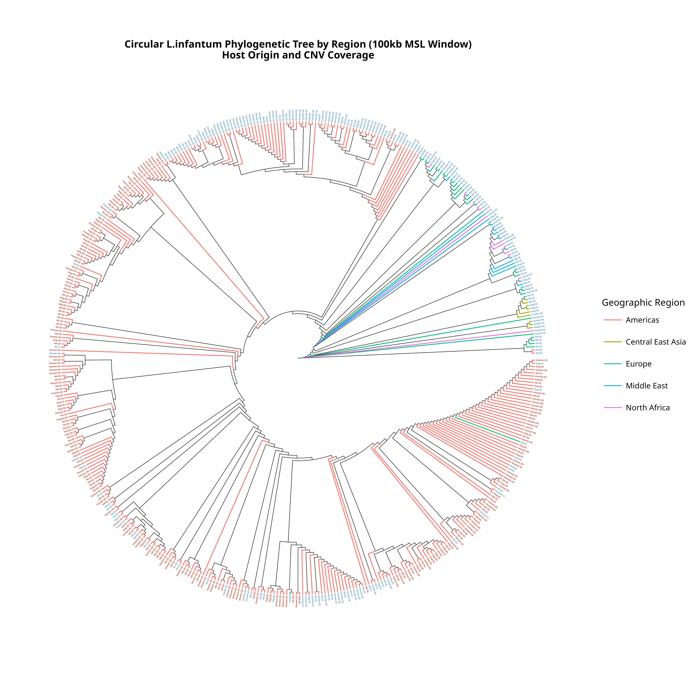
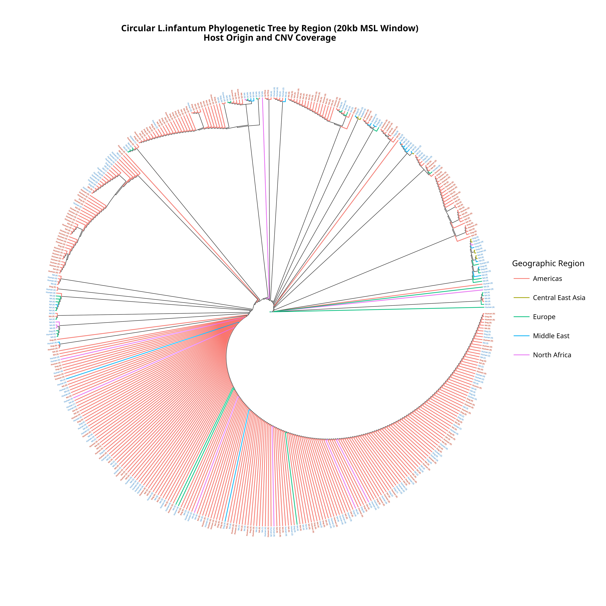

# Population Genomics of Miltefosine Resistance in *Leishmania infantum*

## Overview

*Leishmania infantum* causes visceral leishmaniasis, affecting thousands globally. This project investigates the evolutionary dynamics of miltefosine resistance through population genomic analysis of the Miltefosine Sensitivity Locus (MSL) on chromosome 31.

**Central Research Question:** Is the spread of MSL deletions (conferring drug resistance) driven by positive selection or neutral demographic processes (e.g., drift)?

## Key Findings (Preliminary)

- Clear Old World/New World phylogenetic split.
- 13 distinct populations identified within *L. infantum* via ADMIXTURE.
- MSL deletions predominantly in Brazilian populations.
- Ploidy variation (diploid vs tetraploid) correlates with geography.

---

## Analytical Approach

### 1. Hierarchical Population Structure (ADMIXTURE)

ADMIXTURE analysis identified cryptic population structure across three complementary datasets:

- **All samples + outgroup (K=12):** Species-level structure separating *L. infantum* from *L. donovani*.
- **L. infantum only (K=13):** Fine-scale cryptic populations within *L. infantum*.
- **Americas only (K=13):** High-resolution New World structure where MSL deletions predominate.

Cross-validation error minimisation determined optimal K for each dataset.

#### Cross-Validation Error Justification (K=13)


*Figure 1: Cross-validation error minimisation confirms K=13 as optimal for L. infantum population structure. The lowest CV error at K=13 indicates this number of populations best explains the genetic structure within the species where MSL variation occurs.*

#### Population Assignments (K=13, L. infantum Only)


*Figure 2: ADMIXTURE-inferred population assignments (K=13) showing 13 distinct populations within L. infantum. Brazilian populations dominate the dataset, with clear geographic and genetic structure. This fine-scale resolution reveals cryptic subdivisions relevant to MSL resistance patterns.*

#### Ancestry Proportions (K=13)


*Figure 3: Stacked ancestry barplot showing admixture proportions for each sample (K=13). Samples are ordered by dominant population assignment. Bar heights represent the proportion of ancestry from each of the 13 populations, revealing admixture patterns and population boundaries.*

---

### 2. Multi-Scale Phylogenetic Analysis

Comparing phylogenetic signal at three scales to detect selection on the MSL region:

- **Whole-genome phylogenies:** Neutral evolutionary baseline across all chromosomes.
- **100kb windows around MSL:** Regional selection signal on chromosome 31.
- **20kb windows around MSL:** Fine-scale locus-specific evolution.

Phylogenies stratified by ploidy level (diploid vs tetraploid strains) and annotated with geographic region, host species, and MSL copy number variation.

**Rationale:** If the MSL region is under selection, phylogenetic patterns on chromosome 31 will differ from genome-wide evolutionary history.

#### Whole-Genome Phylogeny (Neutral Baseline)



*Figure 4: Circular maximum likelihood phylogenetic tree based on whole-genome SNPs (L. infantum only, n=463 samples). Tips are coloured by geographic region and annotated with host species (circles = human, triangles = dog) and MSL copy number (symbol size indicates ploidy). Clear Old World/New World split evident with strong bootstrap support.*

#### 100kb Window Around MSL (Regional Selection Signal)



*Figure 5: Phylogenetic tree based on 100kb genomic window surrounding the MSL locus on chromosome 31. Comparison with whole-genome tree reveals topological differences in New World lineages, suggesting localized selection pressure on the MSL region in American populations where miltefosine resistance is prevalent.*

#### 20kb Window Around MSL (Fine-Scale Evolution)



*Figure 6: High-resolution phylogeny from 20kb window directly flanking the MSL genes. Clustering patterns differ from genome-wide phylogeny, with MSL deletions (small symbols indicating low copy number) concentrated in specific Brazilian clades, providing evidence for selection acting on the MSL locus.*

---

### 3. Geographic Distribution Analysis ⏳

Spatial analysis of MSL copy number variation and population distribution across global sampling locations.

**Status:** Collaborative analysis complete, integration in progress.

---

### 4. Hardy-Weinberg Equilibrium Testing ⏳

Tests whether MSL allele frequencies deviate from neutral expectations within populations, distinguishing selection from demographic history.

**Status:** Analysis complete, integration in progress.

---

## Clinical Relevance

MSL deletions confer resistance to **miltefosine**, the only oral treatment for leishmaniasis. Understanding whether resistant strains spread via:

- **Selection:** Faster than expected, requires urgent intervention.
- **Drift:** Random spread, reflects demographic history.

...has direct implications for treatment policy and surveillance strategies.

---

## Methods Summary

**Population Structure:**
- ADMIXTURE v1.3 with K=1-20 tested.
- Cross-validation error minimisation for optimal K selection.
- High-confidence assignments: ≥90% ancestry threshold.

**Phylogenetics:**
- IQ-TREE2 maximum likelihood with 1000 ultrafast bootstrap replicates.
- GTR+F+ASC model (ascertainment bias correction for SNP data).
- ggtree (R) for visualisation with geographic/ploidy annotation.

**Data:**
- 671 *L. infantum* isolates, global sampling.
- Whole-genome sequencing data (VCF format).
- Geographic metadata, MSL copy number (coverage-based).

---

## Repository Structure

```
├── data/
│   ├── metadata/              # Sample information, population assignments
│   ├── population_structure/  # ADMIXTURE input files (.Q files)
│   └── phylogenetic/          # Tree files (.treefile, .contree)
├── scripts/
│   ├── 01_population_structure_admixture.R
│   ├── 02_phylogenetic_whole_genome.R
│   ├── 03_phylogenetic_100kb_windows.R
│   └── 04_phylogenetic_20kb_windows.R
├── results/
│   ├── population_structure/  # Population assignments, summaries
│   ├── phylogenies/           # Tree files
│   └── tables/                # Summary statistics
├── figures/
│   ├── admixture/             # Population structure plots
│   └── phylogenetics/         # Annotated phylogenetic trees
├── readme_images/             # Figures for README display
└── docs/
    ├── methods.md             # Detailed methodology
    └── data_sources.md        # Data provenance
```

---

## Software & Dependencies

**R (v4.4.2):**
- tidyverse, ggtree, treeio, ape, phytools.
- RColorBrewer, ggtext.

**External:**
- ADMIXTURE v1.3.
- IQ-TREE2.
- vcftools (preprocessing).

---

## Data Sources

Genomic data: 671 *L. infantum* isolates from global sampling (Jeffares lab, University of York, unpublished).

---

## Project Status

**Completed:**
- ✅ ADMIXTURE population structure analysis (three datasets).
- ✅ Multi-scale phylogenetic analyses (whole-genome, 100kb, 20kb windows).
- ✅ Ploidy stratification and MSL-region specific analyses.

**In Progress:**
- ⏳ Integration of Hardy-Weinberg equilibrium testing.
- ⏳ Integration of geographic distribution analyses.
- ⏳ Manuscript preparation (collaborative, multi-author).

---

## Author

**Mathew Johansson**  
MSc Bioinformatics, University of York  
Voluntary Research Associate, Jeffares Lab  
GitHub: [@MathewJohansson](https://github.com/MathewJohansson)

---

## Acknowledgements

- Dr. Daniel Jeffares (University of York) - Supervision, data generation.
- Zeynep Sakaoglu - Geographical and HWE analyses collaboration.

---

## Licence

Code: MIT Licence (upon manuscript publication).  
Data: Available upon reasonable request pending publication.

---

## Key References

**ADMIXTURE:**  
Alexander, D.H., Novembre, J. and Lange, K. (2009). Fast model-based estimation of ancestry in unrelated individuals. *Genome Research*, 19(9), 1655-1664.

**IQ-TREE:**  
Nguyen, L.T., Schmidt, H.A., von Haeseler, A. and Minh, B.Q. (2015). IQ-TREE: a fast and effective stochastic algorithm for estimating maximum-likelihood phylogenies. *Molecular Biology and Evolution*, 32(1), 268-274.

---

**Note:** This is an active research project demonstrating bioinformatics workflow, reproducible research practices, and clinical/evolutionary genomics expertise. Analyses are being refined for manuscript preparation as a collaborative, multi-author publication.
